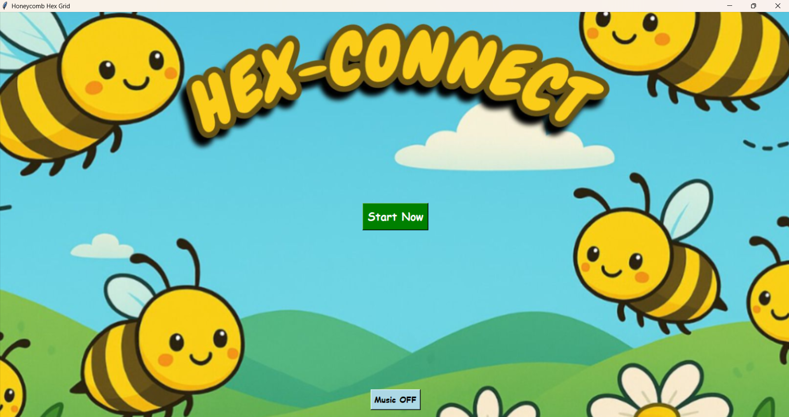
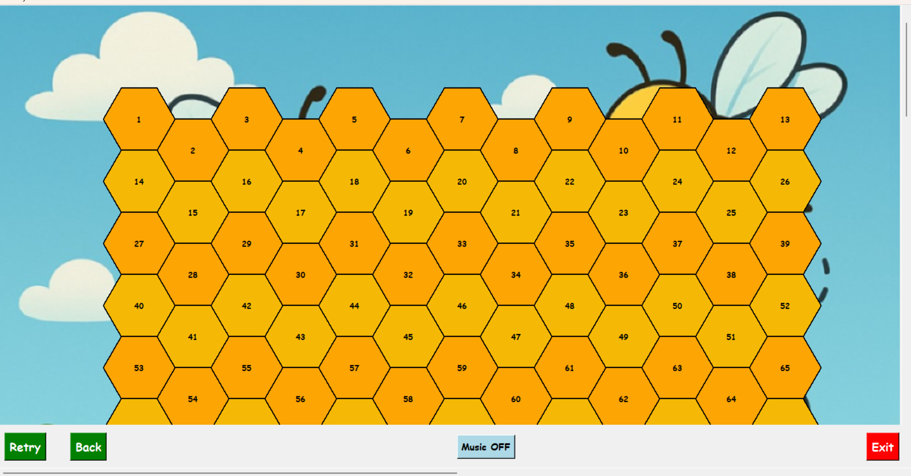
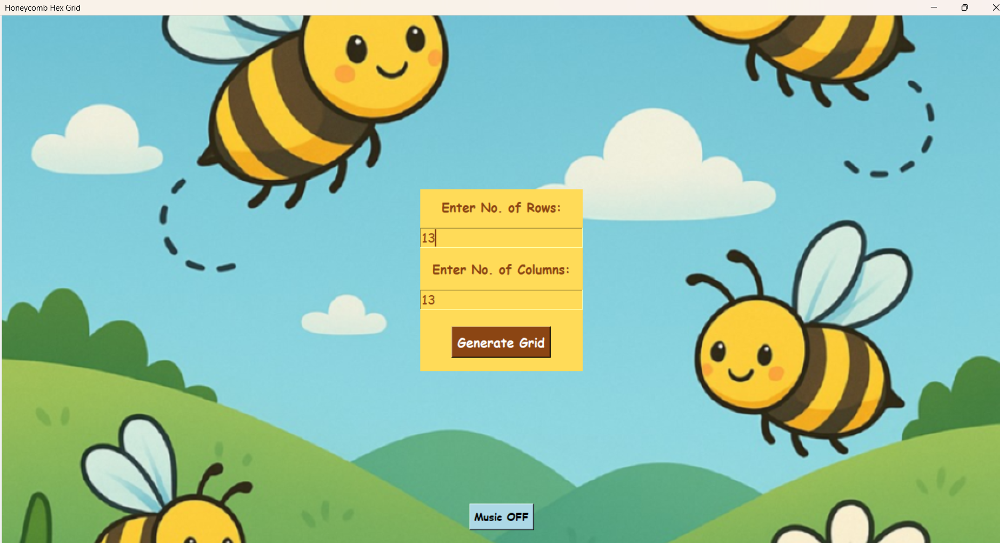
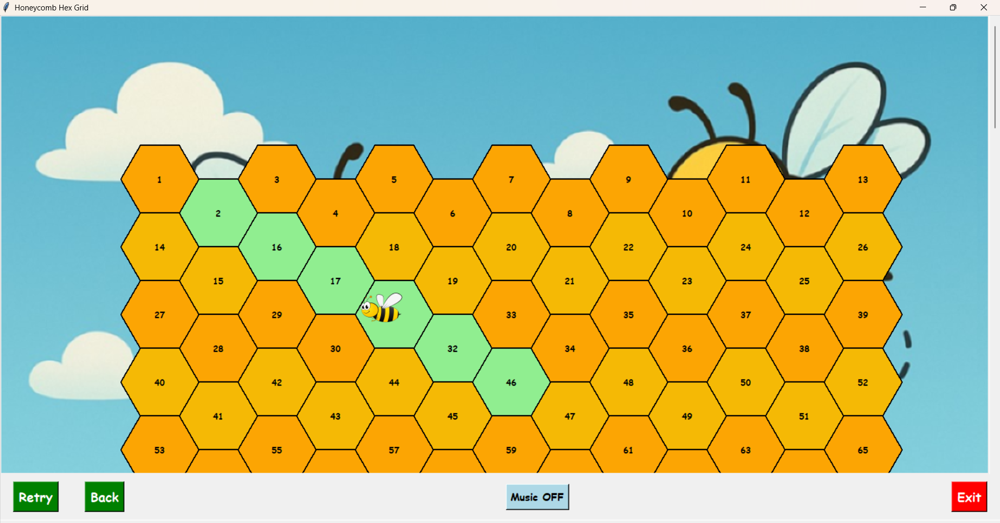
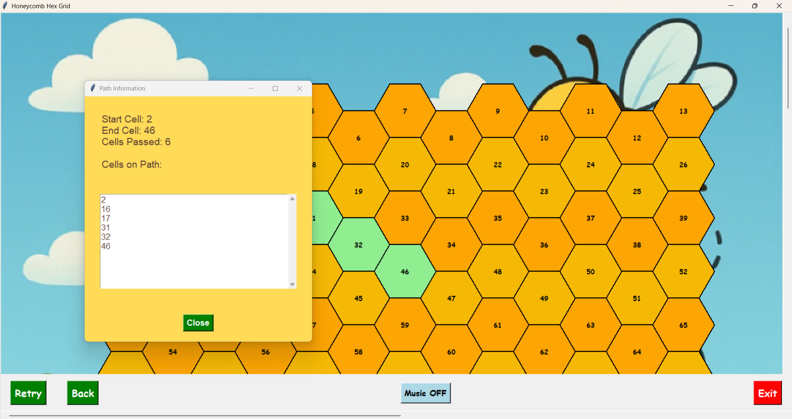

# 🐝 Hex Connect – Honeycomb Hexagonal Grid Visualizer



Hex Connect is a **Python GUI application** that generates a honeycomb-style **hexagonal grid** and visualizes the **shortest path between two selected cells** using hexagonal coordinate algorithms.

The project demonstrates concepts from:

* Computational Geometry
* Hexagonal Grid Algorithms
* GUI Programming
* Animation
* Sound Integration

Built using **Python, Tkinter, and Pygame**, the application also includes **interactive animation, background music, and bee movement simulation**.

---

# 🎮 Demo



Users can:

1. Generate a **custom hex grid**
2. Select **two cells**
3. Watch a **bee animate along the shortest hex path**
4. View **path details in a popup**

---

# ✨ Features

### 🟡 Interactive Hex Grid

* Dynamically generated honeycomb grid
* Custom rows and columns

### 🐝 Bee Animation

* Bee travels along the **shortest hex path**
* Smooth animated movement

### 🎵 Background Music

* Toggleable background music
* Sound effects when the bee moves

### 📐 Hex Coordinate System

Implements:

* **Axial coordinates**
* **Cube coordinate conversion**
* **Hex line interpolation algorithm**

### 🧠 Algorithm Visualization

The application visually demonstrates:

* Hex grid geometry
* Shortest path calculation
* Cell connectivity

---

# 🖼 Interface Preview

### Start Screen


### Grid Generation



### Bee Path Animation



### Path Information Popup



---

# 🧩 Tech Stack

| Technology       | Purpose                   |
| ---------------- | ------------------------- |
| **Python**       | Core programming language |
| **Tkinter**      | GUI framework             |
| **Pygame**       | Sound effects & music     |
| **Math Library** | Hex grid geometry         |

---

# 📂 Project Structure

```
HEX-CONNECT
│
├── Hex_connect.py
├── bee2.png
├── first_image.png
├── bee_first_slide.png
├── assets_bee_buzz.mp3
├── assets_BGM.mp3
│
├── screenshots
│   ├── start.png
│   ├── grid.png
│   ├── bee_animation.png
│   ├── path_info.png
│   └── demo.png
│
└── README.md
```

---

# ⚙️ Installation

### 1️⃣ Clone the repository

```bash
git clone https://github.com/akshayaregidi07-source/HEX-CONNECT.git
cd HEX-CONNECT
```

### 2️⃣ Install dependencies

```bash
pip install pygame-ce
```

### 3️⃣ Run the program

```bash
python Hex_connect.py
```

---

# 🎯 How to Use

1️⃣ Launch the application
2️⃣ Click **Start Now**
3️⃣ Enter number of **Rows** and **Columns**
4️⃣ Generate the **hex grid**
5️⃣ Click two cells to define the path
6️⃣ Watch the **bee animate along the shortest path**

---

# 📐 Algorithm Used

The path calculation uses **hexagonal grid math**:

1. Convert **Axial coordinates → Cube coordinates**
2. Perform **linear interpolation**
3. Round cube coordinates
4. Convert back to **Axial coordinates**

This technique is widely used in:

* Game development
* Pathfinding systems
* Strategy games
* Map generation

---

# 🚀 Future Improvements

* A* pathfinding algorithm
* Obstacles in grid cells
* Multiple bees / agents
* Real-time path editing
* Zoomable grid
* Export grid visualization

---

# 👨‍💻 Author

**Akshaya Regidi**

GitHub
[https://github.com/akshayaregidi07-source](https://github.com/akshayaregidi07-source)

---

# ⭐ Support

If you like this project:

⭐ Star the repository
🍴 Fork the project
📢 Share it with others

---

# 🧠 Inspiration

Hex grids are widely used in:

* Civilization
* Strategy games
* Board games
* Pathfinding simulations

This project demonstrates how **geometry and algorithms combine to create interactive visualizations**.

---

# 📜 License

This project is open-source and available under the **MIT License**.

---


---

